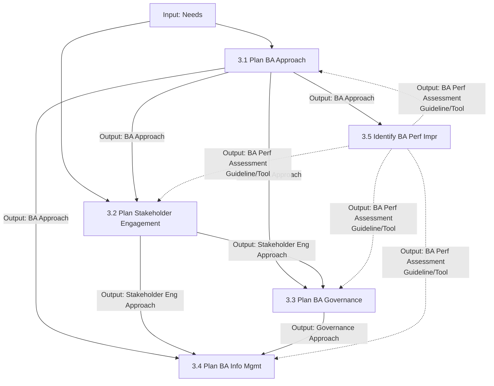

# Business Analysis Planning and Monitoring

## 1. Overview & Core Concept Model Mapping

### Purpose
The **Business Analysis Planning and Monitoring** knowledge area tasks organize and coordinate the efforts of business analysts and stakeholders. The outputs produced here serve as key foundational guidelines for all other business analysis tasks.

### Core Concept Model Application Matrix

| Core Concept | Application in Planning & Monitoring | Key Focus |
| :--- | :--- | :--- |
| **Change** | Determine how changes to business analysis results will be requested and authorized. | Governance & Change Control process |
| **Need** | Choose a business analysis approach that provides adequate analysis for the change. | Match approach (predictive/adaptive) to problem |
| **Solution** | Evaluate if business analysis performance was a key contributor to successful implementation. | Post-implementation performance analysis |
| **Stakeholder** | Perform stakeholder analysis to ensure activities reflect stakeholder needs & characteristics. | Engagement & communication tailoring |
| **Value** | Conduct performance analysis to ensure business analysis activities continue to produce sufficient value. | Cost/benefit & value delivery monitoring |
| **Context** | Ensure a complete understanding of context to develop an efficient business analysis approach. | Environment, regulation & culture awareness |

---

## 2. Master Inputs, Outputs & Guidelines Matrix

> [!IMPORTANT]
> **Key Input/Output Relationships:**
> - **Business Analysis Performance Assessment** (output of 3.5) acts as a **Guideline & Tool** for tasks 3.1, 3.2, 3.3, and 3.4.
> - **Needs** is an **Input** strictly to 3.1 and 3.2.

| Task | Inputs | Guidelines & Tools | Outputs |
| :--- | :--- | :--- | :--- |
| **3.1 Plan BA Approach** | • Needs | • BA Performance Assessment • Business Policies • Expert Judgment • Methodologies & Frameworks • Stakeholder Engagement Approach | **Business Analysis Approach** |
| **3.2 Plan Stakeholder Engagement** | • Needs • BA Approach | • BA Performance Assessment • Change Strategy • Current State Description | **Stakeholder Engagement Approach** |
| **3.3 Plan BA Governance** | • BA Approach • Stakeholder Engagement Approach | • BA Performance Assessment • Business Policies • Current State Description • Legal/Regulatory Information | **Governance Approach** |
| **3.4 Plan BA Info Management** | • BA Approach • Governance Approach • Stakeholder Engagement Approach | • BA Performance Assessment • Business Policies • Information Management Tools • Legal/Regulatory Information | **Information Management Approach** |
| **3.5 Identify BA Performance Improvements** | • BA Approach • Performance Objectives (external) | • Organizational Performance Standards | **Business Analysis Performance Assessment** |

---

## 3. Detailed Task Summaries

---

### Task 3.1: Plan Business Analysis Approach

#### Purpose
Define an appropriate method to conduct business analysis activities (overall method, timing, sequencing, deliverables, and initial techniques).

#### Key Elements

##### 1. Planning Approach (The Continuum)
* **Predictive Approaches:**
  * Goal: Minimize upfront uncertainty, maximize control, minimize risk.
  * Solution defined *before* implementation.
  * Preferred when: Requirements can be defined upfront, risk of failure is high, or stakeholder engagement is difficult.
  * Formality: High, standardized templates, formal phase gate approvals.
* **Adaptive Approaches:**
  * Goal: Rapid delivery of business value via short iterations; accepts higher uncertainty.
  * Solution defined *iteratively*.
  * Preferred when: Exploratory approach, finding best solution, or incremental enhancement.
  * Formality: Informal team interaction, working software feedback, prioritized backlog; formal docs produced *after* implementation for knowledge transfer.

| Dimension | Predictive | Adaptive |
| :--- | :--- | :--- |
| **Solution Definition** | Defined upfront before build | Defined iteratively during build |
| **Formality** | Formal, standardized templates | Informal, team interaction & feedback |
| **Activities Breakdown** | Deliverables identified first $\rightarrow$ split into tasks | Iterations defined $\rightarrow$ deliverables $\rightarrow$ tasks |
| **Timing** | Executed in distinct sequential phases | Executed iteratively throughout |

##### 2. Factors Driving Higher Formality
* Complex, high-risk change
* Heavily regulated industry / legal contracts
* Geographically distributed stakeholders or outsourced vendors
* High staff turnover / inexperienced team
* Formal sign-off mandated / long-term maintenance required

##### 3. Complexity & Risk Factors
* **Complexity Drivers:** Size of change, number of business areas/systems, tech complexity, cultural/geographic dispersion.
* **Risk Drivers:** BA experience/domain knowledge, stakeholder experience/attitude/time availability, imposed methodologies/tools.

#### Key Techniques
* **Brainstorming / Surveys:** Identify activities, risks, techniques.
* **Business Cases:** Understand time-sensitivity, value, and uncertainty.
* **Estimation:** Calculate activity duration.
* **Functional Decomposition:** Break complex BA approaches into components.
* **Lessons Learned:** Leverage past enterprise successes/challenges.
* **Scope Modelling:** Define boundaries for planning and estimating.

---

### Task 3.2: Plan Stakeholder Engagement

#### Purpose
Plan an approach for establishing and maintaining effective working relationships with stakeholders throughout the initiative.

#### Key Elements

##### 1. Stakeholder Analysis (Performed Repeatedly)
* **Roles:** Understand where and how stakeholders contribute.
* **Attitudes:** Assess perception toward business goals, BA, sponsor, team, and collaboration.
  * Positive: Champions & key contributors.
  * Negative: Require specific collaboration plans to increase cooperation.
* **Decision-Making Authority:** Define upfront to eliminate confusion when seeking decisions/approvals.
* **Level of Power / Influence:** Assess influence needed vs. influence possessed. If a mismatch exists, create risk mitigation strategies.

##### 2. Stakeholder Collaboration
* Can be spontaneous, but core collaboration must be **planned**.
* Tailor by group: Timing, frequency, location, tools (wikis, online communities), delivery method (in-person vs. virtual).

##### 3. Stakeholder Communication Needs
Evaluate: What, delivery method, audience, timing, frequency, geography, detail level, and formality.

#### Key Techniques
* **Mind Mapping:** Visualize potential stakeholders and their relationships.
* **Organizational Modelling:** Identify organizational units and interaction patterns.
* **Stakeholder List, Map, or Personas:** Depict relationships to solution and each other (e.g., Power/Interest grid).

---

### Task 3.3: Plan Business Analysis Governance

#### Purpose
Define how decisions are made regarding requirements and designs, including reviews, change control, approvals, and prioritization.

#### Key Elements

##### 1. Decision Making
Defines roles (participant, SME, reviewer, approver) and **escalation paths** when consensus cannot be reached.

##### 2. Change Control Process
Establishes rules for proposing, evaluating, and authorizing changes to requirements/designs.
* **Components of a Change Request:**
  1. *Cost and time estimates*
  2. *Benefits* (aligns with objectives, adds value)
  3. *Risks* (impact on initiative/solution)
  4. *Priority* (relative to competing needs)
  5. *Course(s) of action* (recommended & alternative options)
* **Key Definitions Required:** Traceability/configuration baselines, impact analysis accountability, authorization authority.

##### 3. Prioritization Approach
Determines formality, participants, criteria (cost, risk, value), and process for establishing requirement priorities.

##### 4. Plan for Approvals
Formalizes stakeholder agreement that requirements/designs are accurate, adequate, and sufficiently detailed.
* Heavily influenced by organizational culture and regulatory requirements (e.g., financial/pharma requires rigorous formal sign-off).

---

### Task 3.4: Plan Business Analysis Information Management

#### Purpose
Develop an approach for how business analysis information (requirements, designs, models, elicitation results) will be structured, stored, accessed, and reused.

#### Key Elements

##### 1. Organization & Level of Abstraction
* **Organization:** Avoid duplication and conflicts; define relationships.
* **Level of Abstraction:** Tailor breadth and depth based on stakeholder role, complexity, and risk level.

##### 2. Traceability & Reuse
* **Traceability:** Balanced against cost/overhead; driven by domain complexity, number of views, risk, and regulations.
* **Requirements Reuse Candidates:** High potential for long-term use (Regulatory, Contracts, Quality Standards, SLAs, Business Rules, Core Business Processes, Standard Product Features).
* *Requirement for Reuse:* Must be clearly named, defined, and stored in an accessible repository.

##### 3. The 10 Requirements Attributes

1. **Absolute Reference:** Unique identifier that never changes even if moved/deleted.
2. **Author:** Person to consult if requirement is ambiguous or conflicting.
3. **Complexity:** Implementation difficulty.
4. **Ownership:** Individual/group owning the requirement or business outcome.
5. **Priority:** Relative importance or sequence of implementation.
6. **Risks:** Uncertain events impacting the requirement.
7. **Source:** Origin of the requirement (consulted when underlying need changes).
8. **Stability:** Maturity of the requirement.
9. **Status:** Lifecycle state (proposed, accepted, verified, postponed, cancelled, implemented).
10. **Urgency:** Time-sensitivity / deadline pressure (tracked separately from priority).

---

### Task 3.5: Identify Business Analysis Performance Improvements

#### Purpose
Assess business analysis work and plan actions to improve processes, cycle times, and deliverable quality.

#### Key Elements

##### 1. The 7 Performance Measures

| Measure | What It Evaluates |
| :--- | :--- |
| **Accuracy & Completeness** | Were deliverables correct & relevant, or were constant revisions needed? |
| **Knowledge** | Did the BA possess the required skills/experience for the task? |
| **Effectiveness** | Were deliverables easy to use standalone, or required heavy explanation? |
| **Organizational Support** | Were adequate resources available to complete BA work? |
| **Significance** | Was the benefit/value of deliverables justified relative to cost/time? |
| **Strategic** | Were business objectives met, problems solved, and improvements achieved? |
| **Timeliness** | Was work delivered on schedule per stakeholder expectations? |

##### 2. Recommended Action Types
* **Preventive:** Reduces the probability of a negative event.
* **Corrective:** Reduces the negative impact of an event that occurred.
* **Improvement:** Increases the probability or impact of a positive event.

#### Key Techniques
* **Metrics & KPIs:** Define quantitative/qualitative performance metrics.
* **Process Analysis / Modelling:** Identify hand-off bottlenecks, cycle times, and waste.
* **Root Cause Analysis:** Uncover underlying causes of BA performance failures.

---

## 4. Summary & Input/Output Flow

### Key Functional Relationships:
1. **`Needs` Input Scope:** `Needs` is used directly as an input **ONLY in tasks 3.1 and 3.2**.
2. **`Performance Assessment` Feedback Loop:** `Business Analysis Performance Assessment` is produced by **3.5** and serves as a **Guideline & Tool** back into **3.1, 3.2, 3.3, and 3.4**.
3. **Sequential Dependency:** `BA Approach (3.1)` $\rightarrow$ `Stakeholder Engagement Approach (3.2)` $\rightarrow$ `Governance Approach (3.3)` $\rightarrow$ `Information Management Approach (3.4)`.
4. **Approach Selection Factors:**
   - *Minimize risk upfront, formal sign-off, linear phases, heavily regulated* $\rightarrow$ **Predictive**.
   - *Rapid value, backlog management, short iterations, exploratory, team feedback* $\rightarrow$ **Adaptive**.
