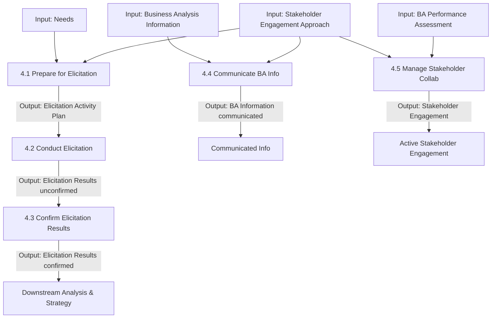

# Elicitation and Collaboration

## 1. Overview & Core Concept Model Mapping

### Purpose
The **Elicitation and Collaboration** knowledge area describes the tasks performed to obtain information from stakeholders, confirm the results, and communicate with stakeholders once business analysis information is assembled. 

* **Elicitation** is drawing forth or receiving information from stakeholders or other sources (direct interaction, research, experimentation, or documentation).
* **Collaboration** is working together towards a common goal to reach mutual understanding of business analysis information.
* Elicitation and collaboration are **ongoing activities** performed continuously across an initiative, occurring as planned events, unplanned interactions, or both.

### Core Concept Model Application Matrix

| Core Concept | Application in Elicitation & Collaboration | Key Focus |
| :--- | :--- | :--- |
| **Change** | Use elicitation techniques to uncover change characteristics and stakeholder concerns. | Technique selection & stakeholder reaction management |
| **Need** | Elicit, confirm, and communicate needs as understanding evolves incrementally. | Iterative discovery & scope clarity |
| **Solution** | Elicit, confirm, and communicate desired characteristics of proposed solutions. | Solution capability definition |
| **Stakeholder** | Manage collaboration across various roles and changing levels of involvement. | Engagement, alignment & trust building |
| **Value** | Assess relative value of information elicited and communicate that value. | Value alignment & prioritization |
| **Context** | Apply elicitation techniques to identify contextual factors affecting the change. | Environmental & domain constraints |

---

## 2. Master Inputs, Outputs & Guidelines Matrix

> [!IMPORTANT]
> **Key Input/Output Relationships:**
> - **Elicitation Results (unconfirmed)** produced in **4.2** is the *only* input to **4.3 (Confirm Elicitation Results)**.
> - **4.4 (Communicate BA Information)** takes general **Business Analysis Information** as an input and outputs **Business Analysis Information (communicated)**.
> - **4.5 (Manage Stakeholder Collaboration)** outputs **Stakeholder Engagement** (willingness of stakeholders to participate).

| Task | Inputs | Guidelines & Tools | Outputs |
| :--- | :--- | :--- | :--- |
| **4.1 Prepare for Elicitation** | • Needs • Stakeholder Engagement Approach | • BA Approach • Business Objectives • Existing BA Information • Potential Value | **Elicitation Activity Plan** |
| **4.2 Conduct Elicitation** | • Elicitation Activity Plan | • BA Approach • Existing BA Information • Stakeholder Engagement Approach • Supporting Materials | **Elicitation Results (unconfirmed)** |
| **4.3 Confirm Elicitation Results** | • Elicitation Results (unconfirmed) | • Elicitation Activity Plan • Existing BA Information | **Elicitation Results (confirmed)** |
| **4.4 Communicate BA Information** | • BA Information • Stakeholder Engagement Approach | • BA Approach • Information Management Approach | **Business Analysis Information (communicated)** |
| **4.5 Manage Stakeholder Collaboration** | • Stakeholder Engagement Approach • BA Performance Assessment | • BA Approach • Business Objectives • Future State Description • Recommended Actions • Risk Analysis Results | **Stakeholder Engagement** |

---

## 3. Detailed Task Summaries

---

### Task 4.1: Prepare for Elicitation

#### Purpose
Understand the scope of the elicitation activity, select appropriate techniques, and plan for or procure supporting materials and resources.

#### Key Elements

##### 1. Understand Elicitation Scope
Factors considered to define scope and boundaries:
* Business domain & corporate culture.
* Stakeholder locations and group dynamics.
* Expected outputs fed by the elicitation.
* Practitioner skill sets & complementary elicitation activities.
* Strategy, solution scope, and candidate information sources.

##### 2. Select Elicitation Techniques
Technique selection depends on cost/time constraints, source accessibility, organizational culture, co-located vs. dispersed team members, and stakeholder availability.

##### 3. Set Up Logistics
Define goals, participants/roles, scheduled resources (rooms, tools), locations, communication channels, techniques, agendas, and stakeholder languages.

##### 4. Secure Supporting Material
Identify and procure documents (policies, regulations, business rules, contracts, existing system docs) and draft analysis models.

##### 5. Prepare Stakeholders
* Educate stakeholders on technique mechanics and purpose to ensure buy-in.
* Request advance review of supporting materials and agendas to maximize session efficiency.

---

### Task 4.2: Conduct Elicitation

#### Purpose
Draw out, explore, and identify information relevant to the change.

#### Key Elements

##### 1. The Three Elicitation Types

| Type | Definition | Key Examples |
| :--- | :--- | :--- |
| **Collaborative** | Direct interaction relying on stakeholder experience and judgment. | Workshops, Interviews, Focus Groups |
| **Research** | Systematic study of sources not directly known by stakeholders. | Document Analysis, Data Mining, Benchmarking |
| **Experiments** | Controlled tests to uncover unknown information. | Prototypes, Proofs of Concept, Observational Studies |

##### 2. Guide Elicitation Activity
Keep sessions focused by monitoring agenda, goals, scope, and expected representations. Recognize when discussions stray off-topic and determine when sufficient information has been elicited to conclude the session.

##### 3. Capture Elicitation Outcomes
Record information during sessions (planned or unplanned) for future reference and integration.

---

### Task 4.3: Confirm Elicitation Results

#### Purpose
Check information gathered during elicitation for accuracy, consistency, and completeness before committing resources to downstream work.

#### Key Elements

##### 1. Compare Against Source Information
Validate captured results against original documents or through stakeholder follow-up reviews to correct errors, omissions, or misinterpretations.

##### 2. Compare Against Other Elicitation Results
Compare outputs across multiple sessions, historical data, or analytical models to identify and resolve inconsistencies or gaps.

> [!NOTE]
> Confirming elicitation results is an initial validation step to ensure mutual understanding, distinct from formal requirements analysis and specification.

---

### Task 4.4: Communicate Business Analysis Information

#### Purpose
Ensure stakeholders possess a shared understanding of business analysis information delivered at the right time, in appropriate formats, and using suitable language.

#### Key Elements

##### 1. Bi-Directional Communication
Communication is not merely pushing data out; it requires actively engaging stakeholders to confirm receipt, understanding, and agreement.

##### 2. Package Formats & Objectives
Packages are structured based on audience needs, formality requirements, and regulatory constraints:
* **Formal Documentation:** Template-based text, matrices, or models providing stable long-term records.
* **Informal Documentation:** Ephemeral models, notes, or whiteboards used during active change.
* **Presentations:** High-level executive overviews for decision-making.

##### 3. Platforms & Delivery Channels
* *Group Collaboration:* Interactive sessions for immediate discussion and consensus.
* *Individual Collaboration:* One-on-one sessions for targeted understanding.
* *Non-Verbal / Written:* Email or portals when information is mature and self-explanatory.

---

### Task 4.5: Manage Stakeholder Collaboration

#### Purpose
Encourage stakeholders to work toward common goals and ensure appropriate participation throughout the business analysis process.

#### Key Elements

##### 1. Gain Agreement on Commitments
Establish early, explicit understanding regarding time, availability, and resource expectations required from stakeholders.

##### 2. Monitor Stakeholder Engagement
Continuously track:
* Effective participation of subject matter experts.
* Stakeholder attitudes, interest, and willingness to collaborate.
* Timely confirmation of elicitation results and approvals.
* Engagement risks (resource diversion, delayed feedback, resistance).

##### 3. Foster Collaborative Relationships
Maintain bi-directional communication, recognize contributions, and ensure stakeholders feel heard to build trust and navigate obstacles effectively.

---

## 4. Summary & Input/Output Flow

### Key Functional Relationships:
1. **Linear Elicitation Pipeline:** `Elicitation Activity Plan (4.1)` $\rightarrow$ `Unconfirmed Results (4.2)` $\rightarrow$ `Confirmed Results (4.3)`.
2. **Communication Trigger:** Task 4.4 takes general `Business Analysis Information` at any stage and packages it for stakeholder understanding.
3. **Collaboration Focus:** Task 4.5 is an ongoing management activity that monitors participation and outputs `Stakeholder Engagement` (the willingness to participate).
