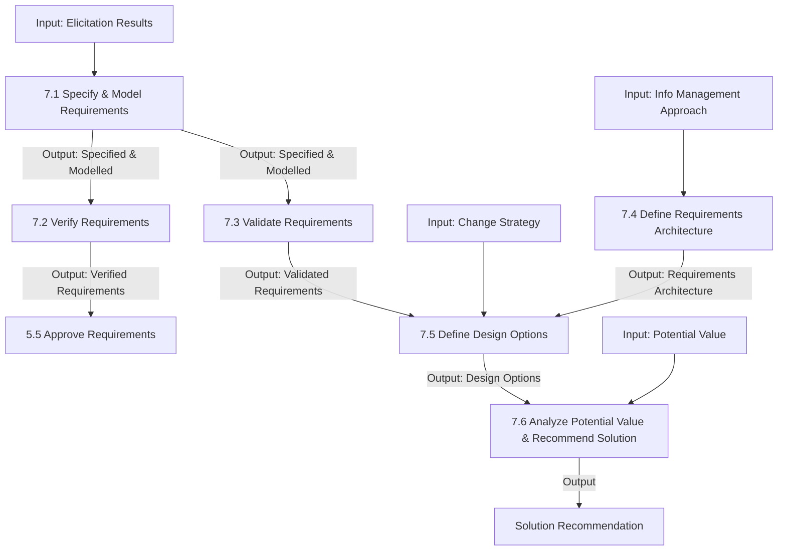

# Requirements Analysis and Design Definition

## 1. Overview & Core Concept Model Mapping

### Purpose
The **Requirements Analysis and Design Definition** knowledge area describes the tasks performed to structure and organize elicitation results, specify and model requirements and designs, verify and validate specifications, define requirements architecture, identify solution options, and estimate the potential value delivered by each option.

* **Requirements vs. Designs:** When the focus is on understanding the business need, outputs are *requirements*. When the focus is on defining a solution representation, outputs are *designs*.
* **The Value Spectrum:** Business analysis activities progress iteratively along a spectrum from identifying *Potential Value* (Strategy Analysis) $\rightarrow$ modeling *Requirements & Designs* (Analysis & Design Definition) $\rightarrow$ validating *Actual Value* (Solution Evaluation).

### Core Concept Model Application Matrix

| Core Concept | Application in Requirements Analysis & Design Definition | Key Focus |
| :--- | :--- | :--- |
| **Change** | Transform raw elicitation results into structured requirements and designs. | Modeling & specification |
| **Need** | Analyze underlying needs to recommend an optimal solution option. | Problem & opportunity alignment |
| **Solution** | Define tactical design options and evaluate which option best satisfies the need. | Design options & recommendations |
| **Stakeholder** | Tailor viewpoints, models, and abstraction levels to specific audience needs. | Viewpoints & communication framing |
| **Value** | Estimate, quantify, and compare the potential net value of design options. | Cost-benefit & opportunity cost analysis |
| **Context** | Model the domain context into formats understandable by all stakeholders. | Contextual modeling & boundaries |

---

## 2. Master Inputs, Outputs & Guidelines Matrix

> [!IMPORTANT]
> **Key Input/Output Relationships:**
> - **7.1 (Specify & Model)** accepts `Elicitation Results (any state)` and produces `Requirements (specified and modelled)`.
> - **7.2 (Verify)** checks requirements quality $\rightarrow$ `Requirements (verified)` (required input for **5.5 Approve Requirements**).
> - **7.3 (Validate)** checks business value alignment $\rightarrow$ `Requirements (validated)` (required input for **7.5 Define Design Options**).
> - **7.5 (Define Design Options)** requires `Requirements (validated, prioritized)` and outputs `Design Options`.
> - **7.6 (Recommend Solution)** compares `Design Options` against `Potential Value` to output `Solution Recommendation`.

| Task | Inputs | Guidelines & Tools | Outputs |
| :--- | :--- | :--- | :--- |
| **7.1 Specify & Model Requirements** | • Elicitation Results (any state) | • Modelling Notations/Standards • Modelling Tools • Requirements Architecture • Requirements Life Cycle Management Tools • Solution Scope | **Requirements (specified and modelled)** |
| **7.2 Verify Requirements** | • Requirements (specified and modelled) | • Requirements Life Cycle Management Tools | **Requirements (verified)** |
| **7.3 Validate Requirements** | • Requirements (specified and modelled) | • Business Objectives • Future State Description • Potential Value • Solution Scope | **Requirements (validated)** |
| **7.4 Define Requirements Architecture** | • Information Management Approach • Requirements (any state) • Solution Scope | • Architecture Management Software • Legal/Regulatory Information • Methodologies and Frameworks | **Requirements Architecture** |
| **7.5 Define Design Options** | • Change Strategy • Requirements (validated, prioritized) • Requirements Architecture | • Existing Solutions • Future State Description • Requirements (traced) • Solution Scope | **Design Options** |
| **7.6 Analyze Potential Value & Recommend Solution** | • Design Options • Potential Value | • Business Objectives • Current State Description • Future State Description • Risk Analysis Results • Solution Scope | **Solution Recommendation** |

---

## 3. Detailed Task Summaries

---

### Task 7.1: Specify and Model Requirements

#### Purpose
Analyze, synthesize, and refine raw elicitation results into formal requirement and design representations.

#### Key Elements

##### 1. Model Formats & Categories
* **Formats:**
  * *Matrices:* Used for uniform, structured data (data dictionaries, traceability matrices, gap analysis, priority attributes).
  * *Diagrams:* Visual representations depicting domain boundaries, hierarchies, relationships, and flows.
* **Model Categories:**

| Category | Description | Primary Techniques |
| :--- | :--- | :--- |
| **People & Roles** | Represents organizational structures, groups, and permissions. | Organizational Modelling, Roles & Permissions Matrix, Personas |
| **Rationale** | Represents the 'why' behind a change or decision. | Business Model Canvas, Root Cause Analysis, Scope Modelling |
| **Activity Flow** | Represents sequences of actions, events, or processes. | Process Modelling, Use Cases & Scenarios, User Stories |
| **Capability** | Represents enterprise or solution features and functions. | Business Capability Analysis, Functional Decomposition, Prototyping |
| **Data & Info** | Represents information characteristics and data exchanges. | Data Modelling, Data Flow Diagrams, State Modelling, Interface Analysis |

##### 2. Requirement Decomposition & Abstraction
Decompose information to isolate what changes, what remains the same, missing elements, constraints, and assumptions. Abstraction levels are tailored to specific stakeholder viewpoints.

---

### Task 7.2: Verify Requirements

#### Purpose
Ensure that specifications and models meet quality standards and exhibit *fitness for use*.

#### Key Elements

##### 1. The 9 Quality Characteristics

1. **Atomic:** Self-contained and understandable independently.
2. **Complete:** Detailed enough to guide downstream work.
3. **Consistent:** Aligned with needs; free of internal contradictions.
4. **Concise:** Free of redundant or unnecessary text.
5. **Feasible:** Achievable within schedule, budget, and risk constraints.
6. **Unambiguous:** Stated with clear pass/fail evaluation clarity.
7. **Testable:** Able to verify fulfillment through test cases or criteria.
8. **Prioritized:** Ranked by relative value and urgency.
9. **Understandable:** Expressed using familiar stakeholder terminology.

---

### Task 7.3: Validate Requirements

#### Purpose
Ensure that requirements and designs align with business goals and deliver the intended business value.

#### Key Elements

##### 1. Verification vs. Validation
* **Verification (7.2):** Focuses on *quality and correctness* (is the requirement built right?).
* **Validation (7.3):** Focuses on *value and business alignment* (is it the right requirement to build?).

##### 2. Validation Activities
* **Identify Assumptions:** Document unproven beliefs regarding customer behavior or root causes.
* **Define Evaluation Criteria:** Establish baseline and target metrics to evaluate success post-implementation.
* **Evaluate Scope Alignment:** Requirements delivering no business benefit are candidates for scope removal.

---

### Task 7.4: Define Requirements Architecture

#### Purpose
Structure all requirements into a cohesive whole where individual models complement each other to achieve business objectives.

#### Key Elements

##### 1. Viewpoints vs. Views
* **Viewpoint:** The set of conventions, standards, and templates defining *how* requirements are represented for a specific stakeholder concern (e.g., Process Viewpoint, Data Viewpoint, Security Viewpoint).
* **View:** The *actual requirements and models* produced for a specific solution using a chosen viewpoint.
* **Architecture:** The complete collection of complementary views.

##### 2. Architecture Quality Criteria
Relationships within the architecture must be **Defined, Necessary, Correct, Unambiguous, and Consistent**.

---

### Task 7.5: Define Design Options

#### Purpose
Define solution approaches, identify business improvement opportunities, allocate requirements, and describe tactical design options.

#### Key Elements

##### 1. Solution Approaches
* **Create:** Custom build or modify an existing internal solution.
* **Purchase:** Select commercial off-the-shelf (COTS) third-party products/services.
* **Combination:** Hybrid approach combining custom components and commercial products.

##### 2. Improvement Opportunities
Automate/simplify workflows to increase efficiency, improve direct information access, or incorporate scalable capabilities for future value.

##### 3. Requirements Allocation
Assign requirements to specific solution components, organizational units, or delivery releases to optimize cost-benefit trade-offs.

---

### Task 7.6: Analyze Potential Value and Recommend Solution

#### Purpose
Estimate expected costs and benefits for each design option to recommend the solution option that delivers the highest net value.

#### Key Elements

##### 1. Value Calculation & Opportunity Cost
* **Expected Benefits:** Financial returns, risk reduction, policy compliance, and improved user experience.
* **Expected Costs:** Acquisition, implementation, operational maintenance, and **Opportunity Cost** (the net value of the best alternative option not chosen).
* **Net Value:** $\text{Expected Benefits} - \text{Expected Costs}$. Value can be tangible or intangible.

##### 2. Recommendation Outcomes
After evaluating trade-offs, constraints, and resource availability, the recommended action may be:
1. Select a single optimal design option.
2. Advance multiple design options to develop proofs-of-concept.
3. Reject all design options and conduct further analysis.
4. **Do nothing** (if costs/risks outweigh benefits across all options).

---

## 4. Summary & Input/Output Flow

### Key Functional Relationships:
1. **Parallel Quality Checks:** Task 7.1 outputs `Requirements (specified and modelled)`, which undergoes **Verification (7.2)** for quality and **Validation (7.3)** for business value.
2. **Design Option Prerequisites:** Task 7.5 requires **`Requirements (validated, prioritized)`** and **`Requirements Architecture`** before design options can be constructed.
3. **Value Spectrum Culmination:** Task 7.6 evaluates `Design Options` against `Potential Value` to output the final **`Solution Recommendation`**.
