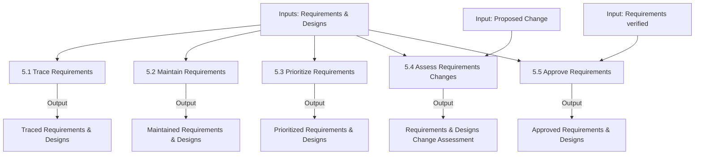

# Requirements Life Cycle Management

## 1. Overview & Core Concept Model Mapping

### Purpose
The **Requirements Life Cycle Management** knowledge area describes the tasks performed to manage and maintain requirements and design information from inception to retirement. It establishes relationships between requirements and designs, assesses proposed changes, and secures consensus and approvals.

* **Life Cycle Scope:** Begins with the representation of a business need as a requirement, continues through solution development, and ends when the solution and its supporting requirements are retired.
* **Separation of Concepts:** The requirement life cycle exists independently of any project methodology; requirements pass through various states and can exist in multiple states simultaneously.

### Core Concept Model Application Matrix

| Core Concept | Application in Requirements Life Cycle Management | Key Focus |
| :--- | :--- | :--- |
| **Change** | Manage how proposed changes to requirements and designs are evaluated. | Change control & impact analysis |
| **Need** | Trace, prioritize, and maintain requirements to ensure the need is satisfied. | Need alignment across life cycle |
| **Solution** | Trace requirements and designs to solution components. | Verification of solution coverage |
| **Stakeholder** | Work closely with key stakeholders to maintain agreement and approval. | Consensus & approval management |
| **Value** | Maintain requirements for reuse to extend value beyond a single initiative. | Requirements reuse & asset preservation |
| **Context** | Analyze context to support tracing and prioritization activities. | Environmental constraints on priority |

---

## 2. Master Inputs, Outputs & Guidelines Matrix

> [!IMPORTANT]
> **Key Input/Output Relationships:**
> - **Requirements (verified)** (from Requirements Analysis and Design Definition) is a required input to **5.5 (Approve Requirements)**.
> - **Proposed Change** is a unique input to **5.4 (Assess Requirements Changes)**.
> - Traceability (**5.1**) outputs **Requirements (traced)** and **Designs (traced)**, which feed directly into design options definition.

| Task | Inputs | Guidelines & Tools | Outputs |
| :--- | :--- | :--- | :--- |
| **5.1 Trace Requirements** | • Requirements • Designs | • Domain Knowledge • Information Management Approach • Legal/Regulatory Information • Requirements Management Tools/Repository | • Requirements (traced) • Designs (traced) |
| **5.2 Maintain Requirements** | • Requirements • Designs | • Information Management Approach | • Requirements (maintained) • Designs (maintained) |
| **5.3 Prioritize Requirements** | • Requirements • Designs | • Business Constraints • Change Strategy • Domain Knowledge • Governance Approach • Requirements Architecture • Requirements Management Tools/Repository • Solution Scope | • Requirements (prioritized) • Designs (prioritized) |
| **5.4 Assess Requirements Changes** | • Proposed Change • Requirements • Designs | • Change Strategy • Domain Knowledge • Governance Approach • Legal/Regulatory Information • Requirements Architecture • Solution Scope | • Requirements Change Assessment • Designs Change Assessment |
| **5.5 Approve Requirements** | • Requirements (verified) • Designs | • Change Strategy • Governance Approach • Legal/Regulatory Information • Requirements Management Tools/Repository • Solution Scope | • Requirements (approved) • Designs (approved) |

---

## 3. Detailed Task Summaries

---

### Task 5.1: Trace Requirements

#### Purpose
Ensure requirements and designs at different levels are aligned to one another, and manage the impact of changes across related elements.

#### Key Elements

##### 1. The Four Relationship Types

| Relationship | Description | Example |
| :--- | :--- | :--- |
| **Derive** | Link requirements across different levels of abstraction. | Solution requirement derived from a high-level Business Requirement |
| **Depends** | One requirement requires another requirement to exist or be implemented. • *Necessity:* Must be implemented together. • *Effort:* Easier to implement if related requirement is completed first. | Feature B cannot function without baseline Authentication Feature A |
| **Satisfy** | Link an implementation component to the requirement it fulfills. | Database schema satisfying a functional data requirement |
| **Validate** | Link a requirement to its corresponding test case or verification criteria. | Test Case TC-101 validating Security Requirement SR-05 |

##### 2. Traceability Benefits
Allows rapid impact analysis, detection of missing functionality (unsupported code), discovery of gaps, and verification of solution coverage.

---

### Task 5.2: Maintain Requirements

#### Purpose
Retain requirement accuracy and consistency throughout and beyond a change, supporting long-term usage and reuse.

#### Key Elements

##### 1. Requirement Maintenance & Attributes
* Keep requirements clearly named, defined, and accessible in a central repository.
* Requirement **attributes** (e.g., source, priority, status, stability) may change during the life cycle even if the core requirement text remains constant.

##### 2. Requirements Reuse
* **Candidates for Reuse:** Regulatory requirements, contracts, SLAs, business rules, standard operational processes, and core product features.
* **Reuse Factors:** Requirements written at higher levels of abstraction (without hardcoded system or department ties) are significantly easier to reuse across current initiatives, departments, or the entire enterprise.

---

### Task 5.3: Prioritize Requirements

#### Purpose
Rank requirements in order of relative importance to guide delivery sequencing and trade-off decisions.

#### Key Elements

##### 1. The Eight Prioritization Criteria

1. **Benefit:** Value accrued to stakeholders relative to business goals.
2. **Penalty:** Negative consequence of non-implementation (e.g., regulatory fines, customer dissatisfaction).
3. **Cost:** Resource & financial effort required to implement (provided by implementation team/vendors).
4. **Risk:** Probability requirement cannot deliver value or is technically infeasible.
5. **Dependencies:** Structural or technical sequencing constraints between requirements.
6. **Time Sensitivity:** Expiration date, seasonal relevance, or time-to-market urgency.
7. **Stability:** Requirement maturity and likelihood of unexpected rework.
8. **Regulatory/Policy Compliance:** Mandatory legal or organizational mandates (often overrides stakeholder preference).

##### 2. Continual Prioritization
Prioritization is ongoing. High-level initial priorities (based on business benefit) are re-evaluated when implementation costs, technical dependencies, and operational constraints are uncovered.

---

### Task 5.4: Assess Requirements Changes

#### Purpose
Evaluate the implications of proposed changes to requirements and designs on solution value, cost, schedule, and risk.

#### Key Elements

##### 1. Impact Analysis Criteria
When evaluating a proposed change, analyze:
* **Benefit:** Value gained by accepting the change.
* **Cost:** Total cost including implementation, rework, and opportunity cost (deferred features).
* **Impact:** Number of affected stakeholders, systems, or business processes.
* **Schedule:** Impact on existing delivery commitments.
* **Urgency:** Time-critical factors (safety, legal mandates).

##### 2. Formality by Approach
* **Predictive:** Highly formal impact analysis to avoid disruptive rework across earlier phase baselines.
* **Adaptive:** Less formal impact analysis; change is managed iteratively through continuous backlog refinement.

---

### Task 5.5: Approve Requirements

#### Purpose
Obtain agreement and sign-off on requirements and designs so that solution construction or subsequent business analysis work can proceed.

#### Key Elements

##### 1. Stakeholder Roles & Conflict Resolution
* Differentiate between decision-makers with formal sign-off authority and influential stakeholders who must be consulted.
* Actively resolve conflicting priorities across stakeholder groups to build consensus before requesting formal approval.

##### 2. Consensus & Tracking
* Unanimity is not mandatory, but any unresolved risks or dissenting views must be formally documented and managed.
* Maintain complete audit records of approvals (who approved, date, version, rationale).

---

## 4. Summary & Input/Output Flow

### Key Functional Relationships:
1. **Verification prerequisite:** Task 5.5 requires **verified requirements** (`Requirements (verified)`), ensuring quality before formal approval.
2. **Change Evaluation trigger:** Task 5.4 is triggered whenever a **`Proposed Change`** is submitted.
3. **Traceability Foundation:** Task 5.1 links requirements via **Derive, Depends, Satisfy, and Validate** relationships to support impact analysis in Task 5.4.
