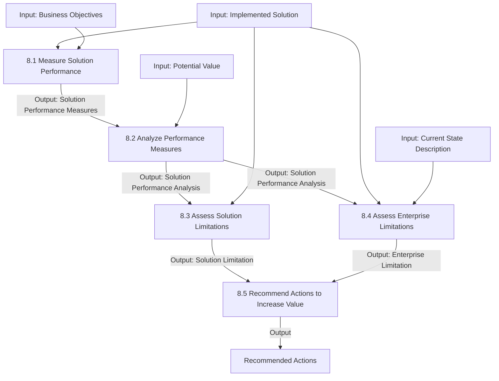

# Solution Evaluation

## 1. Overview & Core Concept Model Mapping

### Purpose
The **Solution Evaluation** knowledge area describes the tasks performed to assess the performance of and value delivered by an **actual solution in use** by the enterprise, and to recommend actions to remove constraints preventing full value realization.

* **Distinctive Feature:** Requires an existing solution or solution component operating in some form (Prototypes/Proofs of Concept, Pilot/Beta releases, or Operational releases).
* **Scope:** Focuses on analyzing actual value delivered, identifying internal and external limitations, and recommending actions to increase value.

### Core Concept Model Application Matrix

| Core Concept | Application in Solution Evaluation | Key Focus |
| :--- | :--- | :--- |
| **Change** | Recommend changes to the solution or enterprise to realize potential value. | Value optimization & modification |
| **Need** | Evaluate how well a deployed solution or component is fulfilling the need. | Solution-need alignment |
| **Solution** | Assess solution performance, measure value delivery, and analyze root causes of underperformance. | Operational performance analysis |
| **Stakeholder** | Elicit feedback from stakeholders regarding solution performance and perceived value. | User & operational feedback |
| **Value** | Determine if actual value matches potential value and identify gaps. | Value realization & gap analysis |
| **Context** | Evaluate how environmental, cultural, and enterprise factors prohibit value realization. | Enterprise & context constraints |

---

## 2. Master Inputs, Outputs & Guidelines Matrix

> [!IMPORTANT]
> **Key Input/Output Relationships:**
> - **Implemented Solution (external)** is a core prerequisite input to **8.1 (Measure)**, **8.3 (Assess Solution Limitations)**, and **8.4 (Assess Enterprise Limitations)**.
> - **8.1 (Measure)** produces `Solution Performance Measures`, which feeds directly into **8.2 (Analyze Performance Measures)**.
> - **8.2 (Analyze)** produces `Solution Performance Analysis`, which is an input to both **8.3 (Solution Limitations)** and **8.4 (Enterprise Limitations)**.
> - **8.5 (Recommend Actions)** combines `Solution Limitation` (8.3) and `Enterprise Limitation` (8.4) to produce `Recommended Actions`.

| Task | Inputs | Guidelines & Tools | Outputs |
| :--- | :--- | :--- | :--- |
| **8.1 Measure Solution Performance** | • Business Objectives • Implemented Solution (external) | • Change Strategy • Future State Description • Requirements (validated) • Solution Scope | **Solution Performance Measures** |
| **8.2 Analyze Performance Measures** | • Potential Value • Solution Performance Measures | • Change Strategy • Future State Description • Risk Analysis Results • Solution Scope | **Solution Performance Analysis** |
| **8.3 Assess Solution Limitations** | • Implemented Solution (external) • Solution Performance Analysis | • Change Strategy • Risk Analysis Results • Solution Scope | **Solution Limitation** |
| **8.4 Assess Enterprise Limitations** | • Current State Description • Implemented Solution (external) • Solution Performance Analysis | • Business Objectives • Change Strategy • Future State Description • Risk Analysis Results • Solution Scope | **Enterprise Limitation** |
| **8.5 Recommend Actions to Increase Solution Value** | • Enterprise Limitation • Solution Limitation | • Business Objectives • Current State Description • Solution Scope | **Recommended Actions** |

---

## 3. Detailed Task Summaries

---

### Task 8.1: Measure Solution Performance

#### Purpose
Define appropriate performance measures and collect data to evaluate the effectiveness of a solution relative to the value it brings.

#### Key Elements

##### 1. Types of Performance Measures
* **Quantitative Measures:** Finite, numerical, or countable metrics (e.g., error rates, processing time, transaction volume).
* **Qualitative Measures:** Subjective feedback capturing stakeholder perceptions, attitudes, and satisfaction.

##### 2. Data Collection Considerations
* **Sample Size & Volume:** Must be large enough to prevent skewed conclusions without imposing impractical overhead.
* **Frequency & Timing:** Selected to capture representative baseline operational conditions.
* **Currency:** Prioritize recent data over outdated historical metrics to ensure accurate representation.

---

### Task 8.2: Analyze Performance Measures

#### Purpose
Interpret and synthesize collected performance data to derive actionable insights regarding solution value.

#### Key Elements

##### 1. Solution Performance vs. Desired Value
High technical performance does not automatically equal high business value contribution. Conversely, a low-performing process might offer immense potential value if optimized.

##### 2. Analytical Factors
* **Trends & Accuracy:** Analyze trends over sufficient timeframes to filter out operational anomalies. Data must be reproducible and repeatable.
* **Performance Variances:** Examine the gap between expected and actual performance. Significant variances require root cause analysis.

---

### Task 8.3: Assess Solution Limitations

#### Purpose
Investigate factors **internal to the solution** that restrict full value realization.

#### Key Elements

##### 1. Internal Dependencies & Problem Analysis
* Solutions are constrained by their weakest internal component or dependency bottleneck.
* Investigate recurring output defects, missed quality targets, or unfulfilled benefit projections.

##### 2. Impact Assessment
Evaluate problem severity, reoccurrence probability, business operational impact, and the organization’s capacity to absorb the impact.

---

### Task 8.4: Assess Enterprise Limitations

#### Purpose
Investigate factors **external to the solution** (within the surrounding enterprise environment) that prohibit full value realization.

#### Key Elements

##### 1. The Four Enterprise Assessment Dimensions

| Dimension | Description | Assessment Focus |
| :--- | :--- | :--- |
| **Enterprise Culture** | Shared beliefs, values, and norms driving enterprise actions. | Stakeholder buy-in, understanding of solution purpose, and cultural adaptability. |
| **Stakeholder Impact** | Effect of solution operation on specific stakeholder groups. | Workflow changes, user locations, and specific user concerns. |
| **Organizational Structure** | Formal and informal reporting relationships. | Ensuring reporting lines, matrix structures, and informal alliances support adoption. |
| **Operational Readiness** | Enterprise infrastructure and capability capacity. | Operational policies, skill gaps, training needs, HR practices, and supporting tools. |

---

### Task 8.5: Recommend Actions to Increase Solution Value

#### Purpose
Identify and define specific actions to close the gap between potential value and actual value.

#### Key Elements

##### 1. Recommendation Options
* **Do Nothing:** Recommended when the cost/risk of change outweighs the potential value increase.
* **Organizational & Workflow Adjustments:** Automate repetitive tasks, simplify interfaces, eliminate process redundancy, avoid non-value-adding waste, and improve access to information.
* **Retire or Replace:** Recommended when technology reaches end-of-life, maintenance costs become unsustainable, or solution alignment fails.

##### 2. Replacement & Retirement Factors
* **Ongoing Cost vs. Upfront Investment:** Comparing escalating maintenance costs of legacy solutions against higher initial capital cost of new alternatives.
* **Opportunity Cost:** Value lost by not devoting resources to higher-yielding alternative projects.
* **Sunk Cost Fallacy:** Money and effort already spent on a solution are unrecoverable and **irrelevant** to future decisions. Recommendations must be based strictly on future investment required versus future benefits gained.

---

## 4. Summary & Input/Output Flow

### Key Functional Relationships:
1. **Prerequisite:** Solution Evaluation requires an operational **Implemented Solution** (prototype, pilot, or full release).
2. **Dual Limitation Analysis:** Performance Analysis (8.2) splits into evaluating internal **Solution Limitations (8.3)** and external **Enterprise Limitations (8.4)**.
3. **Action Alignment:** Recommendations (8.5) synthesize internal defects and external enterprise constraints to deliver actionable recommendations (including solution retirement or ignoring sunk costs).
