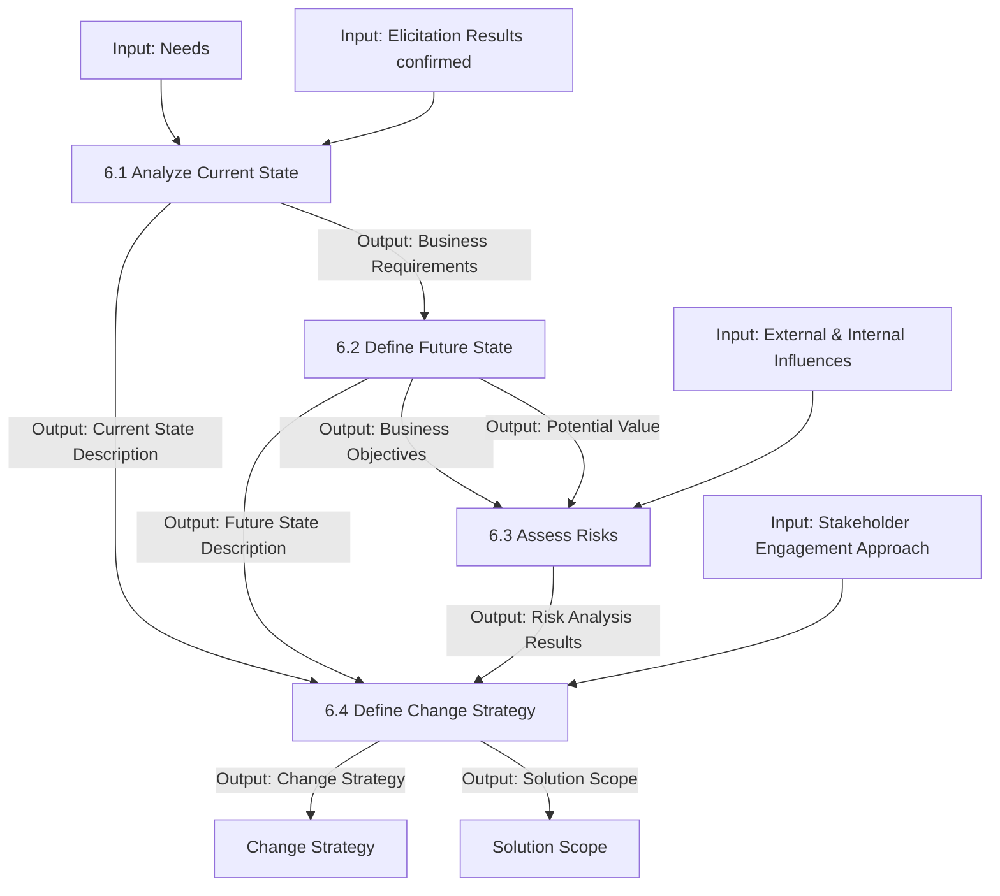

# Strategy Analysis

## 1. Overview & Core Concept Model Mapping

### Purpose
The **Strategy Analysis** knowledge area describes the business analysis work required to identify business needs of strategic or tactical importance, enable the enterprise to address those needs, and align the resulting change strategy with enterprise goals.

* **Strategic Focus:** Establishes the context for downstream requirements analysis and design definition by analyzing the current state, defining a desired future state, assessing risks, and developing a feasible change strategy.
* **The Value Spectrum:** Operates at the origin of change to define the initial *Business Need* and *Solution Scope*, establishing the baseline for *Potential Value*.

### Core Concept Model Application Matrix

| Core Concept | Application in Strategy Analysis | Key Focus |
| :--- | :--- | :--- |
| **Change** | Define the future state and construct a change strategy to achieve it. | Transition planning & strategic alignment |
| **Need** | Identify and prioritize strategic problems or opportunities within the current state. | Problem definition & opportunity capture |
| **Solution** | Define the scope of a solution as part of the overall change strategy. | Solution space boundaries |
| **Stakeholder** | Collaborate with stakeholders to understand strategic needs and align change vision. | Consensus building & readiness assessment |
| **Value** | Estimate potential value of future states to justify investment and change efforts. | Potential value & ROI estimation |
| **Context** | Evaluate enterprise environment, culture, and external forces shaping strategy. | Internal & external environment scanning |

---

## 2. Master Inputs, Outputs & Guidelines Matrix

> [!IMPORTANT]
> **Key Input/Output Relationships:**
> - **6.1 (Analyze Current State)** takes `Needs` and `Elicitation Results (confirmed)` and produces `Current State Description` and `Business Requirements`.
> - **6.2 (Define Future State)** takes `Business Requirements` and produces `Business Objectives`, `Future State Description`, and `Potential Value`.
> - **6.3 (Assess Risks)** takes `Influences (internal/external)`, `Business Objectives`, and `Potential Value` to output `Risk Analysis Results`.
> - **6.4 (Define Change Strategy)** combines `Current State Description`, `Future State Description`, `Risk Analysis Results`, and `Stakeholder Engagement Approach` to output `Change Strategy` and `Solution Scope`.

| Task | Inputs | Guidelines & Tools | Outputs |
| :--- | :--- | :--- | :--- |
| **6.1 Analyze Current State** | • Elicitation Results (confirmed) • Needs | • BA Approach • Enterprise Limitation • Organizational Strategy • Solution Limitation • Solution Performance Goals • Solution Performance Measures • Stakeholder Analysis Results | • **Current State Description** • **Business Requirements** |
| **6.2 Define Future State** | • Business Requirements | • Current State Description • Metrics and KPIs • Organizational Strategy | • **Business Objectives** • **Future State Description** • **Potential Value** |
| **6.3 Assess Risks** | • Elicitation Results (confirmed) • Influences (internal/external) • Requirements & Designs (prioritized) • Business Objectives • Potential Value | • BA Approach • Business Policies • Change Strategy • Current State Description • Future State Description • Identified Risks • Stakeholder Engagement Approach | • **Risk Analysis Results** |
| **6.4 Define Change Strategy** | • Current State Description • Future State Description • Risk Analysis Results • Stakeholder Engagement Approach | • BA Approach • Design Options • Solution Recommendations | • **Change Strategy** • **Solution Scope** |

---

## 3. Detailed Task Summaries

---

### Task 6.1: Analyze Current State

#### Purpose
Understand the underlying business need driving the desire to change, along with the enterprise context, capabilities, and constraints affected.

#### Key Elements

##### 1. Business Needs Origin & Framing
Business needs represent strategic problems or opportunities. They are always expressed from an **enterprise perspective** (not an individual stakeholder perspective) and originate from:
* **Top-down:** Strategic enterprise goals.
* **Bottom-up:** Process, functional, or system inefficiencies.
* **Middle Management:** Management information needs or operational objectives.
* **External Drivers:** Marketplace competition, customer demand, or regulatory mandates.

##### 2. Key Current State Dimensions
* **Capabilities & Processes:** Evaluated via a *capability-centric view* (combining capabilities for innovation) or a *process-centric view* (optimizing end-to-end customer value flow).
* **Culture & Structure:** Assessing shared beliefs, norms, formal reporting hierarchies, and informal alliances.
* **Internal Assets & Infrastructure:** Technology systems, physical plants, financial capital, brand equity, and patents.
* **External Influencers:** Industry structure, competitor dynamics, customer price sensitivity, supplier power, political/regulatory mandates, technology innovations, and macroeconomic factors.

---

### Task 6.2: Define Future State

#### Purpose
Define the necessary conditions, business objectives, and enterprise capabilities required to satisfy the business need.

#### Key Elements

##### 1. SMART Business Objectives
Business goals are converted into specific, measurable objectives using **SMART** criteria:
* **Specific:** Describes an explicit, observable outcome.
* **Measurable:** Trackable via concrete baseline and target metrics.
* **Achievable:** Technically and operationally feasible.
* **Relevant:** Directly aligned with enterprise mission and goals.
* **Time-bounded:** Defined within an explicit target timeframe.

##### 2. Scope of Solution Space & Constraints
Define the boundaries of solution options to consider (e.g., process changes, tech upgrades, structural shifts). Evaluate constraints such as budget, timing, infrastructure, policies, skill availability, and regulatory mandates.

##### 3. Potential Value & Assumptions
Define expected net benefits ($\text{Benefits} - \text{Operating Costs}$). Explicitly document underlying assumptions so that strategy shifts can occur if assumptions prove invalid.

---

### Task 6.3: Assess Risks

#### Purpose
Understand the undesirable consequences of internal and external forces during transition to, or operation in, the future state.

#### Key Elements

##### 1. Risk Elements & Quantification
Analyze risks based on **likelihood, impact severity, time horizon, and potential time frame**. Risks are expressed as conditions that increase the likelihood or severity of a negative impact to value.

##### 2. Risk Tolerance Profiles
* **Risk-averse:** Unwilling to accept high uncertainty; prefers risk avoidance or mitigation investments even at the expense of lower potential value.
* **Neutral:** Accepts moderate risk provided there is no net loss if risk events materialize.
* **Risk-seeking:** Willing to take on high risk in exchange for significantly higher potential value.

##### 3. Recommendations
Options include pursuing change regardless of risk, investing in risk reduction (mitigation/transfer), increasing benefits to offset risk, or abandoning/stopping the change.

---

### Task 6.4: Define Change Strategy

#### Purpose
Develop and assess alternative approaches for transitioning from current state to future state, and select the recommended path.

#### Key Elements

##### 1. Gap Analysis
Compares current state capabilities against future state requirements to identify missing capabilities, tools, processes, or skills.

##### 2. Enterprise Readiness Assessment
Evaluates the enterprise's capacity to execute the change, absorb operational disruption, adapt culturally, and sustain the new state to realize value.

##### 3. Change Strategy & Opportunity Cost
Formulates a high-level transition plan evaluating costs, timelines, business alignment, and **opportunity costs** (value lost by rejecting alternative change strategies).

##### 4. Transition States & Release Planning
When the future state cannot be achieved in a single deployment, define intermediate **transition states**. Release planning structures implementation into phases or iterations based on budget, risk, and organizational absorption capacity.

---

## 4. Summary & Input/Output Flow

### Key Functional Relationships:
1. **Sequential Strategic Foundation:** `Needs` $\rightarrow$ `Analyze Current State (6.1)` $\rightarrow$ `Business Requirements` $\rightarrow$ `Define Future State (6.2)`.
2. **Risk Inputs:** Task 6.3 synthesizes `Business Objectives`, `Potential Value`, and environmental `Influences` to produce `Risk Analysis Results`.
3. **Synthesis in Strategy Definition:** Task 6.4 combines `Current State Description`, `Future State Description`, and `Risk Analysis Results` to establish the final `Change Strategy` and `Solution Scope`.
